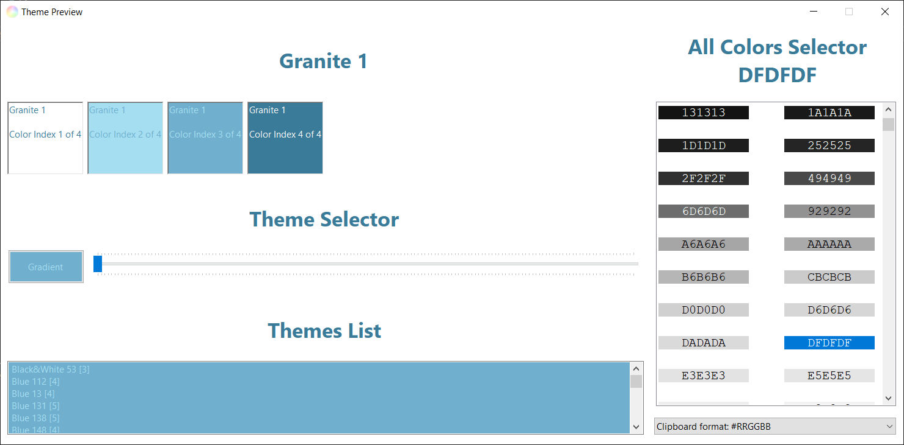

# ThemesLib
ThemesLib is a .NET library for fast access to a themed color list.

Up to now there are 120+ predefined themes from 2 to 8 colors available.
Additionally gradient themes can be created.

ThemesLib is licensed under GPL-2.0-only.

© Alexander Feuster 2022

# ThemesPreview
The ThemePreview demo is a handy tool for showing all available Themes

ThemePreview is licensed under GPL-2.0-only.

© Alexander Feuster 2022

